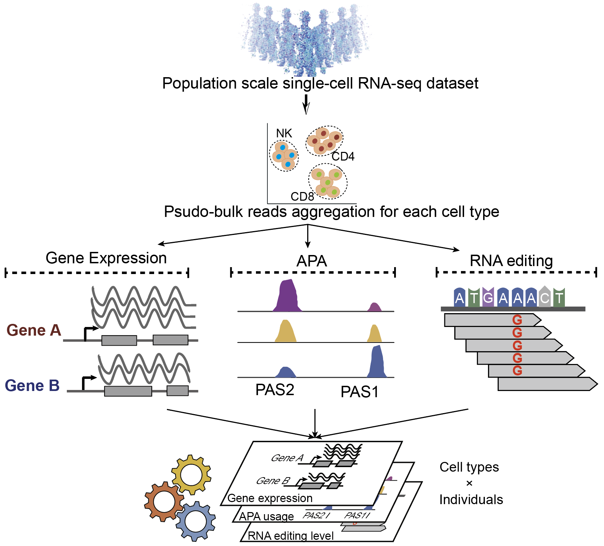

# 

## Overview

**scGEAR** is a computational framework designed to identify transcriptional phenotypes  at a population scale using polyA-enriched single-cell RNA-sequencing data. This tool enables the detection of three distinct RNA phenotypes from single-cell transcriptomic data:

- **Single-cell Gene Expression**
- **Alternative Polyadenylation (APA)**
- **RNA Editing Sites**

With its efficient design, **scGEAR** helps researchers uncover insights into RNA processing, and cellular heterogeneity, offering a comprehensive view of transcriptional diversity at the single-cell level.

<p align="center">
    
</p>


## Key Features

- **Single-Cell Resolution**: work with polyA-enriched single-cell RNA-seq data.
- **Multimodal post-transcriptional modification**: capable of identifying multiple post-transcriptional modification types.
- **Population-Scale Analysis**: scalable to large datasets, enabling population-level studies of transcriptional phenotypes.

## Installation

To use **scGEAR**, clone the repository and install the required dependencies.

### Requirements

- Python (>=2.7)
- R (>=4.10)
- [samtools](https://www.htslib.org/)
- [umitools](https://umi-tools.readthedocs.io/en/latest/QUICK_START.html)
- [sinto](https://timoast.github.io/sinto/)

### Installation Steps

1. Clone this repository:
    ```bash
    git clone https://github.com/dingruofan/scGEAR.git
    cd scGEAR
    ```

2. Install dependency with mamba
    ```bash
    conda install -n base mamba
    mamba env create -f environment.yml
    conda activate scGEAR
    ```


## Usage

**scGEAR** provides a command-line interface (CLI) for ease of use. Below is a basic example of how to run **scGEAR** to analyze single-cell RNA-seq data.

### Example

```bash
Rscript scGEAR.R \
  --cellinfo cell_info.txt \
  --cellrangerDir cellranger \
  --genome_fa genome.fa \
  --mode ed \
  --REDIportal_tab REDIportal_noRSid.tab.gz \
  --py2_path envs/py2.7/bin/python \
  --read_strand 1 \
  --threads 50 \
  --umitools_path /home/dingruofan/anaconda3/envs/py3.9/bin/umi_tools \
  --samtools_path /usr/bin/samtools \
  --sinto_path /home/dingruofan/anaconda3/envs/py3.9/bin/sinto \
  --outdir /media/bora_A/dingruofan/2023-10-16_RNA_editing_project/tmp
```

### Parameters

scGEAR starts with the outputs from **cellranger**, user need to specify two parameters for scGEAR 

- `--cellinfo`: path to the cell information table in TSV format, containing four columns with the following column names: `POOL`, `cell_id`, `cluster`, `ind`, such as:

  | POOL   | cell_id            | cluster | ind      |
  | ------ | ------------------ | ------- | -------- |
  | POOL_1 | AAACCCACACCATTCC-1 | CD4     | sample_1 |
  | POOL_1 | AAACCCACATCCGATA-1 | CD4     | sample_2 |
  | POOL_2 | AAACCCATCTCTGCTG-1 | Mono    | sample_1 |
  | POOL_2 | AAACGAACATTGAGGG-1 | Mono    | sample_2 |

- `--cellrangerDir`: the output directory of cellranger, including the results of the cellrange for each pool. click [here](assets/cellranger_dir.png) to view an example of the directory structure.

- `--genome_fa`: genome sequence file in fasta format.

- `--outdir`: Path to the output directory where results will be saved.

- `--mode`: Specify the analysis mode (`exp`, `apa`, `ed`, `all`).

### Running Gene Expression Analysis

To perform gene expression analysis:

```bash
python scgear.py --input data/single_cell_data.csv --output results/ --mode gene_expression
```

### Running Alternative Polyadenylation Analysis

To identify alternative polyadenylation events:

```bash
python scgear.py --input data/single_cell_data.csv --output results/ --mode alternative_polyadenylation
```

### Running RNA Editing Site Identification

To detect RNA editing sites:

```bash
Rscript /media/bora_A/dingruofan/2023-10-16_RNA_editing_project/src/scGEAR/scGEAR.R \
  --cellinfo /media/bora_A/dingruofan/2023-10-16_RNA_editing_project/src/scGEAR/test_real/cell_info.txt \
  --cellrangerDir /media/pacific/share/Datasets/Immune_data/Single-cell-immune-QTL/Aquino2023Nature/scRNAseq/cellranger \
  --genome_fa /media/bora_A/zhangt/src/hg38_cellranger_index/fasta/genome.fa \
  --mode ed \
  --REDIportal_tab /media/bora_A/dingruofan/2023-10-16_RNA_editing_project/src/scGEAR/ref/REDIportal_noRSid.tab.gz \
  --py2_path /home/dingruofan/anaconda3/envs/py2.7/bin/python \
  --read_strand 1 \
  --threads 50 \
  --umitools_path /home/dingruofan/anaconda3/envs/py3.9/bin/umi_tools \
  --samtools_path /usr/bin/samtools \
  --sinto_path /home/dingruofan/anaconda3/envs/py3.9/bin/sinto \
  --outdir /media/bora_A/dingruofan/2023-10-16_RNA_editing_project/tmp
```

## Output

The results will be saved in the specified output directory, and they include matrix of multimodal molecular phenotypes for each cell cluster, where the columns represent sample IDs and the rows represent phenotype names.

## License

This project is licensed under the GPL License - see the [LICENSE](LICENSE.md) file for details.

## Acknowledgments

Thanks to the following individuals for their contributions to this project:

- Lei Li: Provided design ideas and guidance throughout the project..
- Ting zhang: Assisted in the implementation of the APA and gene expression analysis module.
- Ruofan Ding: Assisted in the implementation of the RNA editing site analysis module and tool deployment .


---

We hope **scGEAR** helps you advance your research on single-cell transcriptome data analysis. Happy coding!